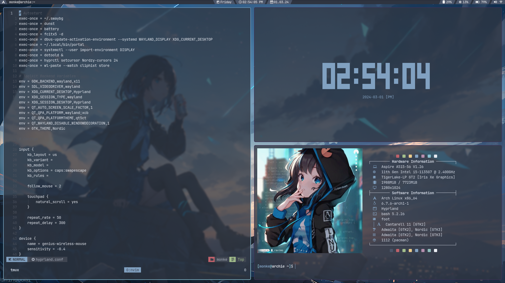

# Screenshots




# Installation (for me not you)
```
rm .bashrc
echo ".dotfiles" >> .gitignore
git clone --bare https://github.com/MonkieeBoi/wl-dotfiles.git $HOME/.dotfiles
git --git-dir=$HOME/.dotfiles --work-tree=$HOME checkout
source .bashrc
config config --local status.showUntrackedFiles no
pacman -S - < ~/Downloads/pkgs
```

# What I Use
**Operating System** - [Arch Linux](https://archlinux.org/)

**Color Scheme** - [Nord](https://www.nordtheme.com/)

**Compositor** - [Hyprland](https://github.com/hyprwm/Hyprland)

**Terminal** - [foot](https://codeberg.org/dnkl/foot)

**Text Editor** - [NeoVim](https://neovim.io/)

**Menus** - [tofi](https://github.com/philj56/tofi)

**File Manager** - [vifm](https://vifm.info/)

**Browser** - [qutebrowser](https://qutebrowser.org/)

**Image Viewer** - [imv](https://sr.ht/~exec64/imv/)

**Wallpaper setter** - [swaybg](https://github.com/swaywm/swaybg)

**Screenshots** - [grim](https://sr.ht/~emersion/grim/) + [slurp](https://github.com/emersion/slurp)

**Audio Visualiser** - [CAVA](https://github.com/karlstav/cava)

**Notifications** - [dunst](https://dunst-project.org/)

**Font** - [JetBrains Mono Nerd Font](https://www.nerdfonts.com/)
